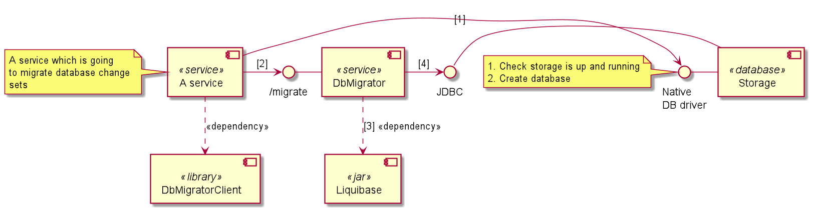
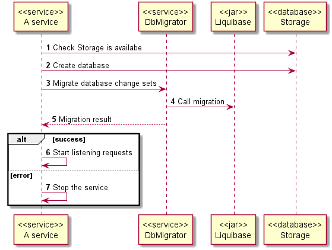

# About

This is a service that helps to use [Liquibase](https://www.liquibase.org/)
as a service that other services can use for database migration on running.

It is based on the official [Liquibase Docker Image] and adds a small nodejs
service to handle http requests for db migration.

# Getting started

If you want to start an example of db migration, you need to use
docker compose:

```
    docker-compose --env-file docker-compose.env up -d
```

If you want to replace only a single container, you should follow the steps:

1. `docker-compose stop <container name>`
2. `docker-compose --env-file=docker-compose.env up -d --no-deps <container name>`

# How it works

**[Component Model](dev/models/component-model.puml)**



**[Sequence Diagram](dev/models/how-it-works.pusequence)**



# How to use

Add a container to docker compose (see example in [docker-compose](./docker-compose.yaml)):

```yaml
  db-migrator:
    image: akaeigenspace/db-migrator
    ports:
      - 4010:4010
    environment:
      DB_HOST: storage
      DB_PORT: 5432
      DB_USERNAME: postgres
      DB_PASSWORD: postgres
      CHANGELOG_FILENAME: master.xml
```

The container starts the service on the port 4010 by default.

A service that wants to migrate its database changes should use the following API:

```
  curl -X POST --location "http://localhost:4010/migrate" \
    -H "Content-Type: multipart/form-data; boundary=boundary" \
    -F "changelog=@/path/to/changelog-archive/changelog.tar;filename=changelog.tar;type=*/*"
```

The migration service expects that:

1. the archive with changelog is named `changelog.tar`
2. `changelog.tar` has the following structure:

    ```
      000--changeset.{sql|xml}
      ...
      00N--changeset.{sql|xml}
      master.xml
    ```
3. `master.xml` includes all the change sets with relative paths 
   `relativeToChangelogFile="true"`.
   
See [example-service](./dev/example-service) for an example how to create an appropriate
docker image and request db migration.

# Why do we have that dependencies?

* `express` - we use it to create an API for uploading change sets.
* `express-fileupload` - we use it to parse from a http request
  a changelog archive that a service wants to migrate.

# Why do we have that dev dependencies?

* `@eigenspace/codestyle` - includes lint rules, config for typescript.
* `@eigenspace/commit-linter` - linter for commit messages.
* `@types/*` - contains type definitions for specific library.
* `@vercel/ncc` - it builds the service into the single runnable nodejs script.
* `eslint` - it checks code for readability, maintainability, and functionality errors.
* `eslint-plugin-eigenspace-script` - includes set of script linting rules
  and configuration for them.
* `husky` - used for configure git hooks.
* `lint-staged` - used for configure linters against staged git files.
* `ts-node` - to run without build typescript.
* `typescript` - is a superset of JavaScript that have static type-checking and ECMAScript features.
